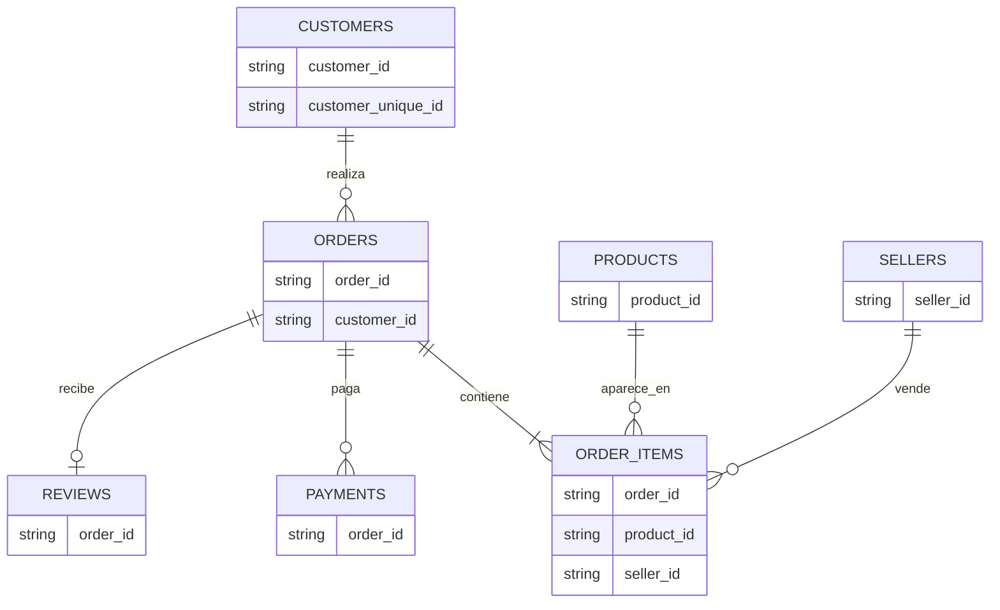

# Modelo Entidad–Relación

## Descripción

El conjunto de datos de Olist está compuesto por varias tablas relacionadas mediante identificadores únicos. La tabla **orders** constituye el eje central del modelo, ya que conecta la información de clientes, productos, pagos, vendedores y reseñas.

## Relaciones entre tablas

### customers → orders

- Llave: `customer_id`
- Relación: **1:N**

Un cliente puede realizar múltiples pedidos.

### orders → order_items

- Llave: `order_id`
- Relación: **1:N**

Un pedido puede contener uno o varios productos.

### order_items → products

- Llave: `product_id`
- Relación: **N:1**

Cada ítem corresponde a un único producto.

### order_items → sellers

- Llave: `seller_id`
- Relación: **N:1**

Cada producto es vendido por un vendedor.

### orders → payments

- Llave: `order_id`
- Relación: **1:N**

Un pedido puede pagarse mediante uno o varios pagos.

### orders → reviews

- Llave: `order_id`
- Relación: **1:1**

Cada pedido puede tener una reseña asociada.

### customers ↔ geolocation

- Llave: `customer_zip_code_prefix`
- Relación: **N:1**

Permite asociar la ubicación geográfica de los clientes.

### sellers ↔ geolocation

- Llave: `seller_zip_code_prefix`
- Relación: **N:1**

Permite asociar la ubicación geográfica de los vendedores.

